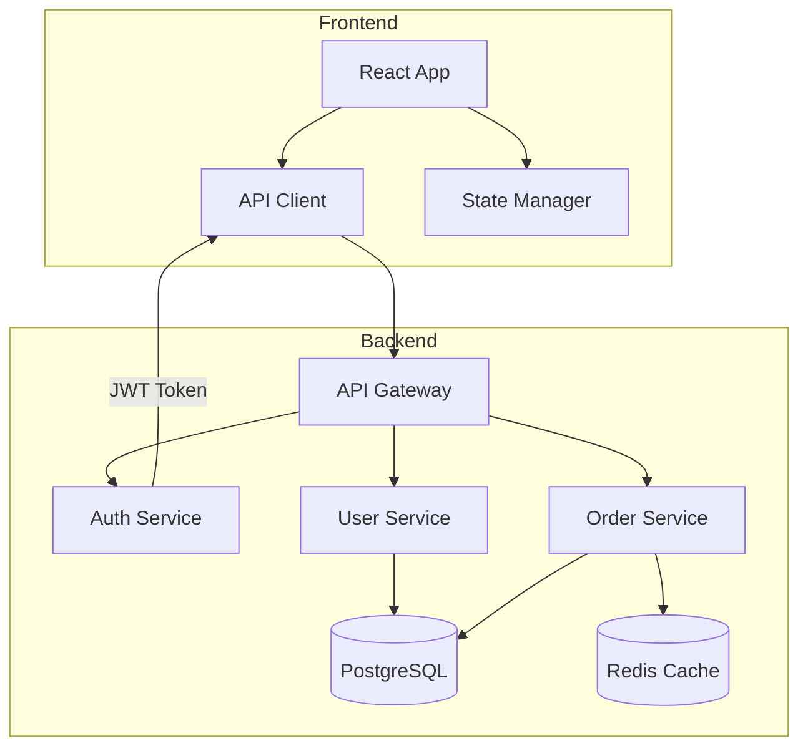
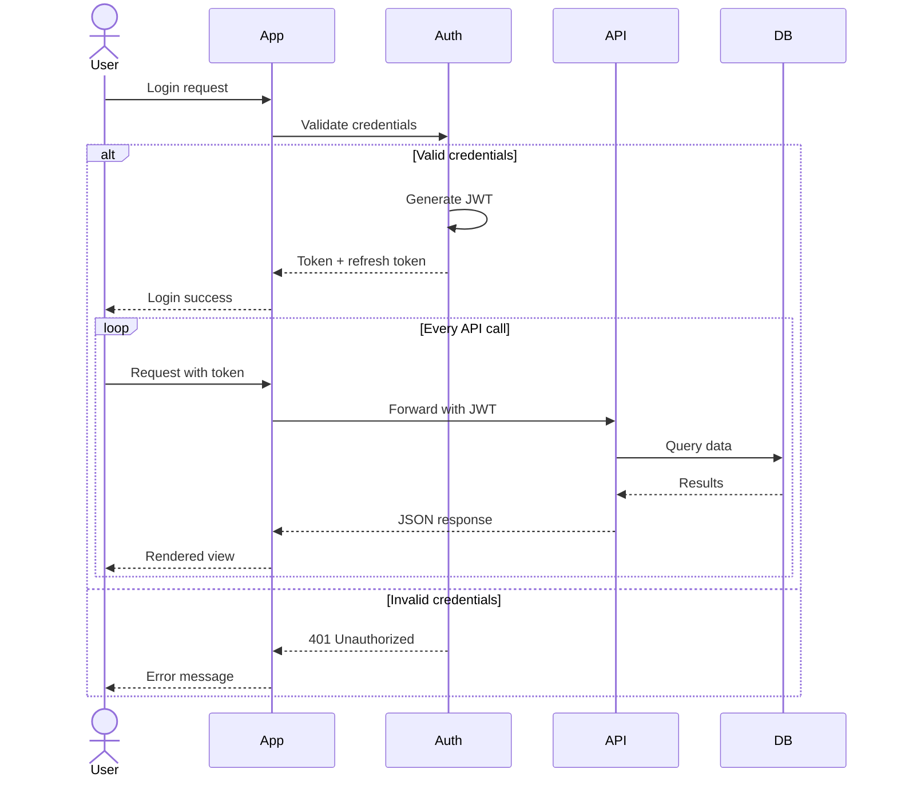
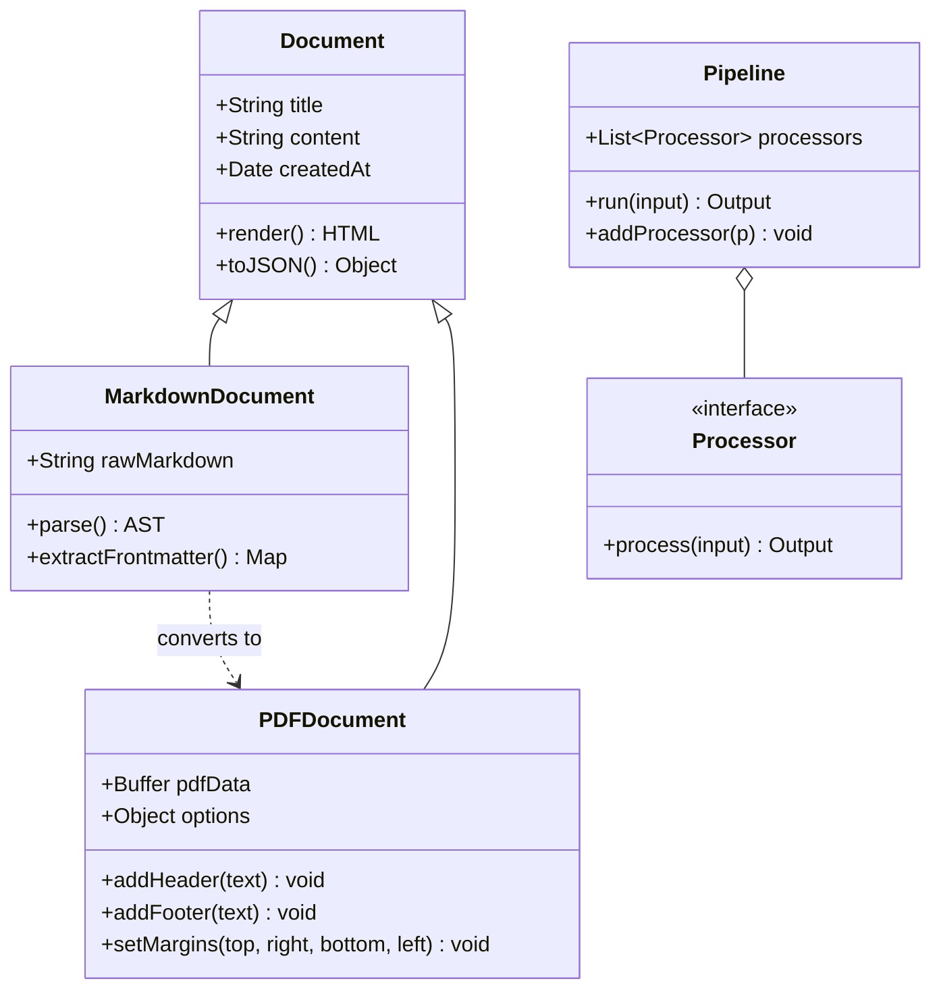
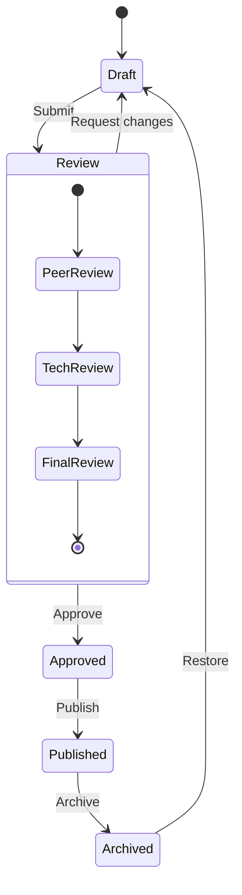
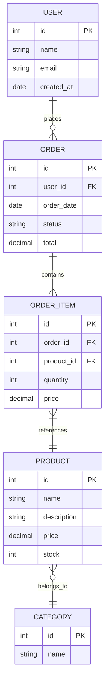
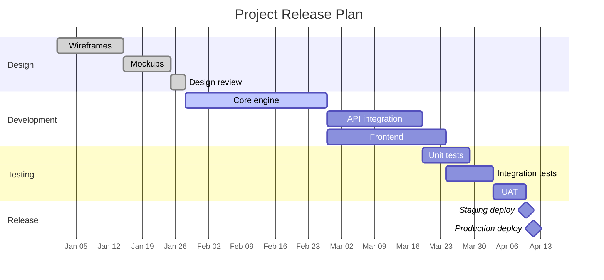
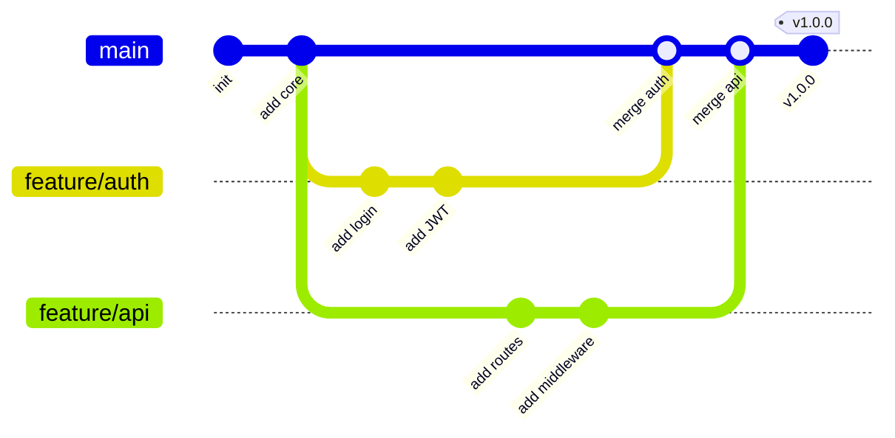

# Complex Mermaid Diagrams

## Flowchart with subgraphs

## Sequence Diagram with loops and alternatives

## Class Diagram

## State Diagram

## Entity Relationship Diagram

## Gantt Chart

## Git Graph

